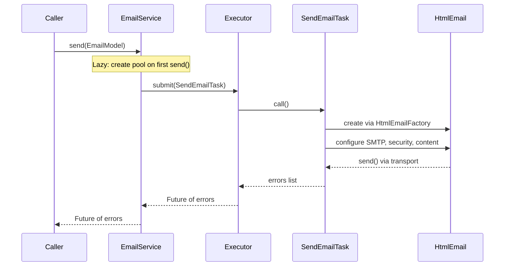

# Architecture Overview

ErmesMail follows a straightforward layered design: a CLI entry point delegates to a service layer that manages async email delivery via a thread pool, using Apache Commons Email as the underlying transport.

## Package Structure

All production code lives in a single package:

```
com.softinstigate.ermes.mail
```

This keeps the library small and embeddable. There are no sub-packages — the entire public API is eight classes.

## Core Class Relationships

```
┌─────────────────────────────────────────────────────────────────┐
│  Main (CLI entry point)                                         │
│  - Parses args with picocli                                     │
│  - Creates SMTPConfig + EmailModel                              │
│  - Calls EmailService.send()                                    │
└─────────────────────────────────────────────────────────────────┘
                              │
                              ▼
┌─────────────────────────────────────────────────────────────────┐
│  EmailService                                                   │
│  - Owns an ExecutorService (fixed thread pool)                  │
│  - send() submits SendEmailTask → returns Future<List<String>>  │
│  - sendSynch() calls SendEmailTask.call() directly              │
│  - shutdown() terminates the executor                           │
└─────────────────────────────────────────────────────────────────┘
                              │
                              ▼
┌─────────────────────────────────────────────────────────────────┐
│  SendEmailTask implements Callable<List<String>>                │
│  - Configures HtmlEmail from SMTPConfig + EmailModel            │
│  - Handles attachments, recipients, STARTTLS/SSL                │
│  - Calls email.send() → returns error list                      │
└─────────────────────────────────────────────────────────────────┘
                              │
                              ▼
┌─────────────────────────────────────────────────────────────────┐
│  Apache Commons Email (HtmlEmail)                               │
│  - javax.mail transport under the hood                          │
└─────────────────────────────────────────────────────────────────┘
```

## Data Flow

1. **Input** — Caller provides `SMTPConfig` (server + security mode) and `EmailModel` (message + recipients).
2. **Dispatch** — `EmailService.send()` wraps the task in a `SendEmailTask` and submits to the thread pool.
3. **Build** — `SendEmailTask.call()` creates an `HtmlEmail` via `HtmlEmailFactory`, configures host/port/auth/security, sets HTML body, attaches files, adds recipients.
4. **Send** — `HtmlEmail.send()` delegates to javax.mail for SMTP transport.
5. **Result** — Errors (if any) are collected in a `List<String>` and returned through the `Future`.

For synchronous usage, `EmailService.sendSynch()` bypasses the executor and calls `SendEmailTask.call()` directly on the calling thread.



*EmailService async send flow with lazy thread pool initialization.*

## Async Execution Model

`EmailService` uses `Executors.newFixedThreadPool(threadPoolSize)` to parallelize email sends. Key behaviors:

- **Thread pool size** is configurable at construction (e.g., `new EmailService(config, 3)` uses 3 threads). The default constructor uses `Runtime.getRuntime().availableProcessors()`.
- **Lazy initialization** — the `ExecutorService` is created on the first `send()` call, not in the constructor. This lazy initialization is thread-safe via a `synchronized` accessor method. Applications that only use `sendSynch()` never create a thread pool.
- **poolSize = 0** — no internal pool is ever created; `send()` executes synchronously and returns an already-completed `Future`. This is designed for callers that manage concurrency externally (e.g., virtual threads in RestHeart). `shutdown()` is a no-op.
- **AutoCloseable** — `EmailService` implements `AutoCloseable`, so the pool (if created) is shut down automatically in try-with-resources blocks.
- **send()** returns a `Future<List<String>>` immediately; callers block on `Future.get()` when they need the result.
- **shutdown()** calls `executor.shutdown()` followed by `awaitTermination()` with a 10-second default timeout. If the timeout elapses, `shutdownNow()` is called to force-terminate abandoned tasks.
- `send()` after `shutdown()` throws `IllegalStateException`.

The CLI (`Main.java`) uses a pool size of 1 and blocks on `Future.get()` immediately, so it behaves synchronously.

## SMTP Security Modes

Introduced in v2.0.0, `SMTPConfig.SecurityMode` is an enum that expresses the transport security intent:

| Mode | Factory Method | Behavior |
|------|----------------|----------|
| `PLAIN` | `SMTPConfig.forPlain(...)` | No encryption (port 25/1025) |
| `SSL` | `SMTPConfig.forSsl(...)` | Implicit TLS on connect (port 465) |
| `STARTTLS_OPTIONAL` | `SMTPConfig.forStartTlsOptional(...)` | Upgrade to TLS if server supports it, otherwise plaintext |
| `STARTTLS_REQUIRED` | `SMTPConfig.forStartTlsRequired(...)` | Fail if server doesn't advertise STARTTLS |

The CLI maps `--sslon` → SSL, `--starttls` → STARTTLS_OPTIONAL, `--starttls-required` → STARTTLS_REQUIRED. Flags `--sslon` and `--starttls` are mutually exclusive (validated in `Main.call()`).

## Testability

`HtmlEmailFactory` is an interface that abstracts `HtmlEmail` creation. Production code uses `DefaultHtmlEmailFactory`; tests inject a Mockito mock to verify STARTTLS/SSL configuration without a live SMTP server.

This pattern was introduced in v2.0.0 specifically to make `SendEmailTask` testable.

## Logging Security

Since v2.1.0, `SMTPConfig.toString()` redacts the username and `EmailModel.toString()` redacts the message body. Both classes have `toSecureString()` methods that omit credentials and content entirely, reporting only metadata (hostname, port, security mode, recipient counts).

`EmailService` and `SendEmailTask` use `toSecureString()` for their log lines, so default log output never exposes passwords or email content.

## Socket Timeouts

Since v3.0.0, `SMTPConfig` includes configurable socket timeouts:
- **Connection timeout** — default 10 seconds (`DEFAULT_CONNECTION_TIMEOUT`)
- **Socket read timeout** — default 60 seconds (`DEFAULT_SOCKET_TIMEOUT`)

These are applied via `HtmlEmail.setSocketConnectionTimeout()` and `HtmlEmail.setSocketTimeout()` in `SendEmailTask`.
