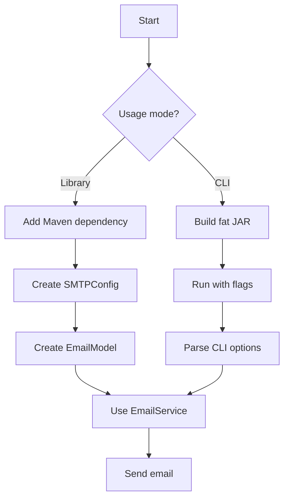

# ErmesMail Quickstart

ErmesMail (Ἑρμῆς Mail) is a Java library and CLI tool for sending HTML emails asynchronously via SMTP. It wraps [Apache Commons Email](https://commons.apache.org/proper/commons-email/) with a clean API and adds a [picocli](https://picocli.info/)-based command-line interface for shell usage.

**Current version:** 3.0.1-SNAPSHOT (released: 3.0.0)  
**License:** Apache License 2.0  
**Organization:** [SoftInstigate srl](https://softinstigate.com)

## Two Ways to Use

1. **As a library** — embed in your Maven project and call `EmailService` programmatically
2. **As a CLI tool** — build a fat JAR and send emails from the shell



*Figure: Two paths to send email with ErmesMail — library (programmatic) and CLI (shell).*

## Build

```shell
mvn package
```

Produces `target/ermes-mail.jar` (shaded fat JAR with all dependencies).

## CLI Usage

```shell
java -jar target/ermes-mail.jar --help
```

Key flags:
- `-h/--host`, `-p/--port` — SMTP server (default: localhost:25)
- `-u/--user`, `-P/--password` — credentials
- `--sslon` + `--sslport` — implicit SSL (SMTPS, typically port 465)
- `--starttls` / `--starttls-required` — STARTTLS upgrade
- `-f/--from`, `-n/--sender`, `-s/--subject`, `-b/--body` — email content
- `--to`, `--cc`, `--bcc` — recipients (comma-separated)

**Quick test with Mailpit:**

```shell
# Start Mailpit (local SMTP mock), then:
java -jar target/ermes-mail.jar -h localhost -p 1025 \
  -f sender@email.com -s "Test" -b "<strong>Hello</strong>" \
  --to receiver@email.com
```

## Library Usage

Add JitPack repository and the `ermes-mail:3.0.0:shaded` dependency to your pom.xml. See [README.md](../README.md) for the full Maven snippet and javax.mail version warnings.

```java
SMTPConfig smtpConfig = SMTPConfig.forPlain("localhost", 1025, "user", "password");
EmailModel emailModel = new EmailModel("from@ex.com", "Sender", "Subject", "<b>Body</b>");
emailModel.addTo("to@ex.com", "Recipient");

try (EmailService emailService = new EmailService(smtpConfig)) {
    Future<List<String>> errors = emailService.send(emailModel); // async, pool created lazily
    // or: List<String> errors = emailService.sendSynch(emailModel); // synchronous
}
```

Key 3.0 features:
- **Lazy thread pool** — the `ExecutorService` is created only on the first `send()` call
- **Virtual threads support** — `threadPoolSize=0` disables internal pool, letting callers manage concurrency externally
- **Socket timeouts** — configurable `connectionTimeout` and `socketTimeout` in `SMTPConfig`
- **`AutoCloseable`** — `EmailService` implements `AutoCloseable` for try-with-resources
- **Input validation** — early `NullPointerException`/`IllegalArgumentException` on invalid inputs

## Key Documentation Pages

| Page | What It Covers |
|------|----------------|
| [Architecture Overview](architecture/overview.md) | Package structure, class relationships, data flow |
| [Domain Concepts](domain/concepts.md) | SMTPConfig, EmailModel, EmailService, SecurityMode |
| [Source Map](source-map.md) | File-by-file guide to the codebase |
| [Testing Guide](testing/guide.md) | Unit tests, integration tests, mocking patterns |
| [Operations](operations/runbook.md) | SMTP configuration, CI/CD, troubleshooting |

## Task Routing

| Change Area | Wiki Page | Source Entry Point | Key Symbols | Focused Tests | Validation |
|-------------|-----------|-------------------|-------------|---------------|------------|
| Add CLI flag | [Source Map](source-map.md), [Domain](domain/concepts.md) | `Main.java` | `@Option` fields, `call()` | `MainCliTest.java` | `mvn test` |
| New SMTP security mode | [Architecture](architecture/overview.md), [Domain](domain/concepts.md) | `SMTPConfig.java`, `SendEmailTask.java` | `SecurityMode` enum, `forXxx()` factory, `configureSecurity()` | `SMTPConfigTest.java`, `SendEmailTaskTest.java` | `mvn test` |
| Change email sending logic | [Domain](domain/concepts.md) | `SendEmailTask.call()` | `configureSenderAndContent()`, `processAttachments()` | `SendEmailTaskTest.java` | `mvn test` |
| Thread pool / concurrency | [Architecture](architecture/overview.md), [Domain](domain/concepts.md) | `EmailService.java` | `send()`, `sendSynch()`, `shutdown()`, `getExecutor()` | `EmailServiceTest.java` | `mvn test` |
| Recipient/Attachment model | [Domain](domain/concepts.md) | `EmailModel.java` | `Recipient` record, `Attachment` record | `EmailModelTest.java` | `mvn test` |
| HtmlEmailFactory seam | [Architecture](architecture/overview.md), [Domain](domain/concepts.md) | `HtmlEmailFactory.java`, `DefaultHtmlEmailFactory.java` | `HtmlEmailFactory` interface, `DefaultHtmlEmailFactory` implementation | `SendEmailTaskTest.java`, `DefaultHtmlEmailFactoryTest.java` | `mvn test` |
| Integration test scenario | [Testing](testing/guide.md) | `IntegrationScenariosIT.java` | `scenarios()`, `DynamicTest` | `IntegrationScenariosIT.java` | `mvn verify` |
| CI pipeline | [Operations](operations/runbook.md) | `.github/workflows/ci.yml` | `BYTEBUDDY_VERSION`, `argLine` | — | push to branch |
| Dependency update | [Operations](operations/runbook.md) | `pom.xml`, `update-dependencies.sh` | `bytebuddy.version` property | all tests | `mvn test` |
| Release / version bump | [Operations](operations/runbook.md) | `setversion.sh` | `pom.xml` version, git tag | `mvn package` | `./setversion.sh <ver> --dry-run` |

## Project Structure (Quick Reference)

```
src/main/java/com/softinstigate/ermes/mail/
  Main.java              — CLI entry point (picocli)
  EmailService.java      — Async/sync email sender (ExecutorService)
  EmailModel.java        — Email data model (recipients, attachments)
  SMTPConfig.java        — SMTP server config + security mode
  SendEmailTask.java     — Callable that sends via Commons Email HtmlEmail
  HtmlEmailFactory.java  — Abstraction for testability
  DefaultHtmlEmailFactory.java — Production factory
  VersionProvider.java   — CLI version display

src/test/java/com/softinstigate/ermes/mail/
  SMTPConfigTest.java          — Unit tests for config factories
  SendEmailTaskTest.java       — Unit tests with Mockito
  DefaultHtmlEmailFactoryTest.java — Factory contract test
  EmailModelTest.java          — Model validation and secure logging tests
  EmailServiceTest.java        — Thread pool lifecycle tests
  MainCliTest.java             — CLI flag parsing tests
  IntegrationScenariosIT.java  — Live SMTP integration tests

setversion.sh                  — Release versioning script (semver + git tag)
update-dependencies.sh         — Maven dependency update script
```
